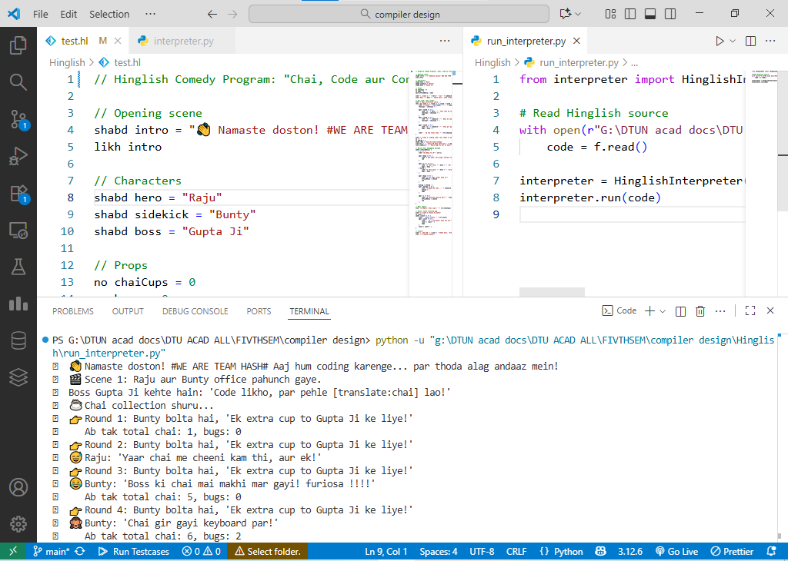

# 🪶 Hinglish Programming Language

**Hinglish** — a tiny experimental programming language that mixes Hindi + English keywords.  
This repository demonstrates lexical analysis and interpretation (a compact compiler front-end) so you can *write* and *run* Hinglish code on your machine.
- A simple interpreter written in Python.
---

## 🔥 Quick: Run a Hinglish program

1. Put your Hinglish source in a file with the `.hl` extension, e.g. `program.hl`.  
2. Open a terminal in the project folder (where `run_interpreter.py` is located).  
3. Run:
   ```bash
   python run_interpreter.py

📁 Project layout
```
Hinglish/
│
├── hinglish             ← (the CLI runner script)
├── run_interpreter.py   ← (simple debug/test launcher)
├── lexer.py             ← (lexical analyzer / tokenizer)
├── interpreter.py       ← (core execution engine)
├── test.hl              ← (example Hinglish program)
└── README.md            ← (documentation + usage guide)

```

## 🧾 Language Overview

### Keywords & Meaning

| Hinglish | English | Description |
|----------|---------|-------------|
| `no` | int | Integer type |
| `binduno` | float | Floating-point type |
| `sach` | bool | Boolean type |
| `shabd` | string | String type |
| `sahi` / `jhooth` | true / false | Boolean literals |
| `likh` | print | Output statement |
| `agar` / `warna` | if / else | Conditional statements |
| `jabtk` | while | Loop statement |
| `chal` | for | For loop |
| `se` / `tak` / `tk` | from / to | Range helpers |
| `aur` / `ya` / `nahin` | and / or / not | Logical operators |
| `lautao` | return | Return statement |
| `tod` / `aage` | break / continue | Loop control |

## 📌 Syntax Notes

- Statements can end with `;` or newline
- Blocks use braces `{ ... }`
- Strings use double quotes: `"hello"`
- Expressions follow Python-like syntax (`+`, `-`, `*`, `/`, comparisons)
### Declaration

## 🔢 Variables & Data Types

### Declaration
```hinglish
no x = 5            # integer
### Type Binding
At declaration, values are cast to the declared type:
```

### Type Binding
At declaration, values are cast to the declared type:
```hinglish
no a = 3.7      # a becomes 3 (int)
binduNo b = 2   # b becomes 2.0 (float)
sach f = jhooth # f becomes False
```

### Variables Demo (`variables_demo.hl`)

## 🧪 Example Programs

### Variables Demo (`variables_demo.hl`)
```hinglish
no a = 5
binduNo b = 3.14
sach flag = jhooth

likh "a = " + str(a)
likh "b = " + str(b)
likh "flag = " + str(flag)

no c = 2.9      # c becomes 2
binduNo d = 7   # d becomes 7.0

likh "c = " + str(c)
likh "d = " + str(d)
```

### Control Flow (`test.hl`)
```hinglish
no i = 1
sach isHot = sahi

agar (isHot) {
    likh "Bahar garmi hai!"
} warna {
    likh "Thand hai bhai..."
}

jabtk (i < 5) {
    likh "i abhi hai: " + str(i)
    i = i + 1
}
```

### Running Programs
```bash
python run_interpreter.py
```

Or directly:
```bash
python hinglish.py program.hl
```

## Implementation Notes

- Expression evaluation uses Python's `eval()`
## See How it works (DEMO)
WRITE CODE IN FILENAME.hl like test.hl and run:
```bash
python run_interpreter.py FILENAME.hl
or 
run run_interpreter.py directly from vs code run button 
- Make sure python is installed in your system
- It uses python at backend to run the hinglish code
```



## Quick & Lightweight (recommended for now)

Open a Hinglish file (test.hl) in VS Code.
Click the bottom-right corner of VS Code where it says “Plain Text.”


### Choose → Configure File Association for ‘.hl’… → Python
or choose JavaScript (just to get basic colorization).

### select any language to colorize the text


VS Code will now treat .hl like Python — instant colors!
It’s not “true Hinglish syntax highlighting,” but it works well for testing.

## ✨ Future Features

- [ ] Strict type enforcement on assignment
- [ ] Functions (`kaam karo`)
- [ ] Module imports
- [ ] Better error messages with line numbers
- [ ] VS Code syntax highlighting
- [ ] Arrays and data structures
- [ ] Functions (`kaam karo`)
- [ ] Module imports
- [ ] Better error messages with line numbers
- [ ] VS Code syntax highlighting

## 📜 License

MIT License - Feel free to use and modify!

## 👤 Author

**Manish Singh**  
Repository: [HinglishCodeCompiler](https://github.com/yourusername/Hinglish)

---

*Made with ❤️ for Hindi-speaking developers*
